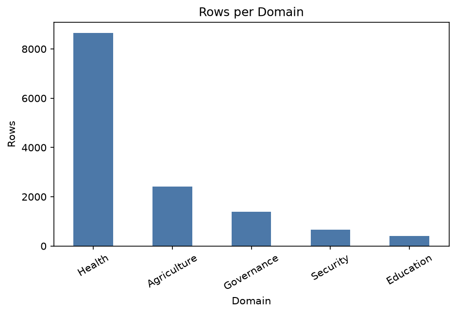
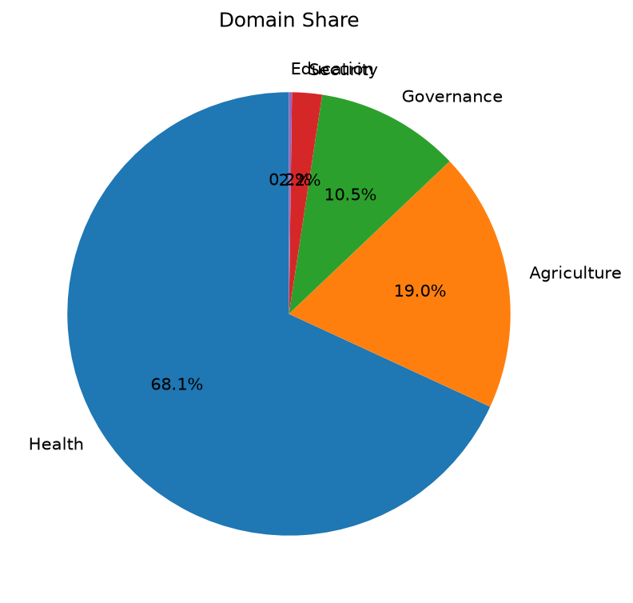
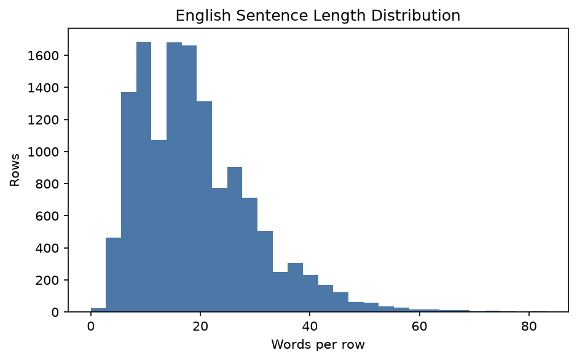
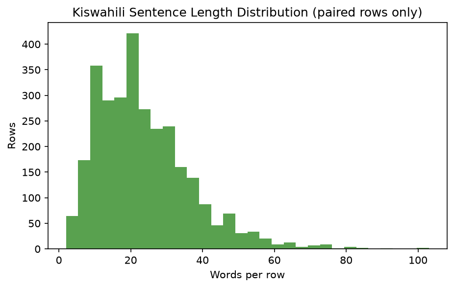
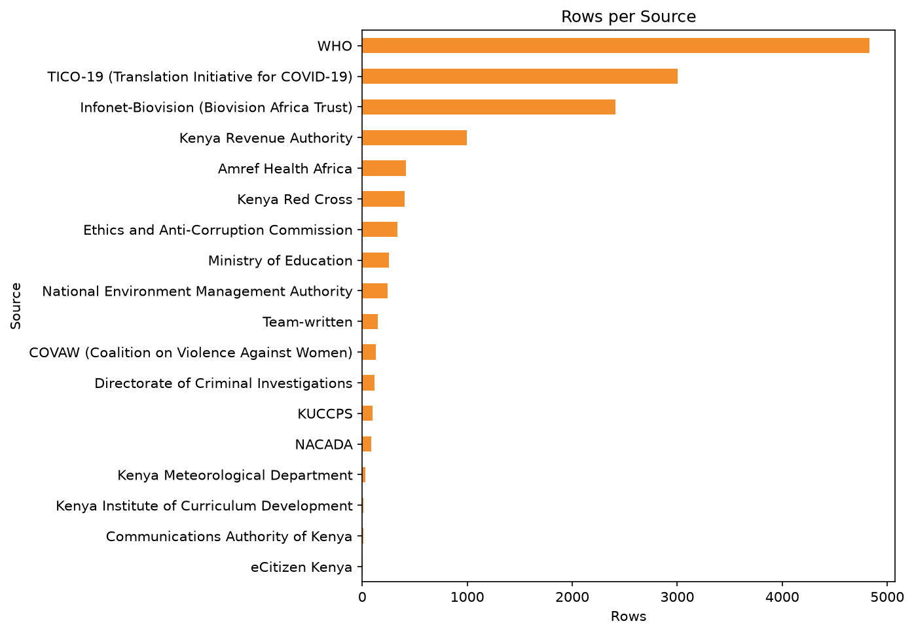
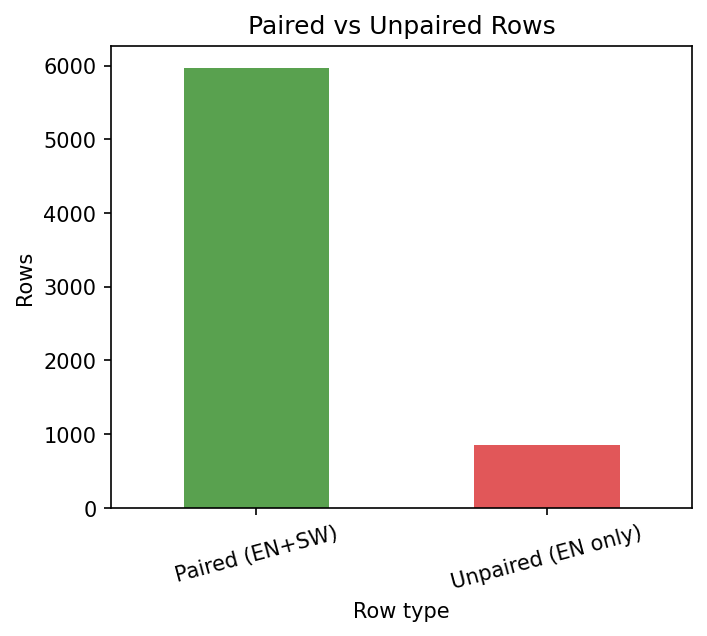

# Week 2 EDA Report — PSA Parallel Dataset (EN–SW)

_DSA4020A, Group 10 — generated by `src/eda.py`_

## Overview

- **Total rows:** 6,823
- **Paired rows (EN+SW):** 5,972 (87.5%)
- **Unpaired rows (EN only):** 851
- **Code-switched rows (EN column):** 0
- **Rows containing glossary terms:** 120
- **Vocabulary (EN / SW):** 11,551 / 12,177 unique word types

## Figures

## Domain distribution

| Domain | Rows | Share | Mean EN words |
|---|---|---|---|
| Health | 3,944 | 57.8% | 22.3 |
| Security | 952 | 14.0% | 14.5 |
| Education | 828 | 12.1% | 10.7 |
| Agriculture | 559 | 8.2% | 18.7 |
| Governance | 540 | 7.9% | 22.8 |

## Source distribution

| Source | Rows |
|---|---|
| TICO-19 (Translation Initiative for COVID-19) | 3,004 |
| Lecturer dataset (PSA_KE_Final) | 2,852 |
| WHO | 401 |
| Infonet-Biovision (Biovision Africa Trust) | 210 |
| Team-written | 150 |
| Kenya Revenue Authority | 78 |
| Amref Health Africa | 29 |
| Kenya Red Cross | 22 |
| National Environment Management Authority | 15 |
| Directorate of Criminal Investigations | 15 |
| Ethics and Anti-Corruption Commission | 13 |
| KUCCPS | 12 |
| Ministry of Education | 7 |
| NACADA | 7 |
| COVAW (Coalition on Violence Against Women) | 6 |
| eCitizen Kenya | 1 |
| Kenya Meteorological Department | 1 |

## Sentence length (word tokens)

| Language | Mean | Median | Min | Max |
|---|---|---|---|---|
| English | 19.6 | 18 | 3 | 81 |
| Kiswahili (paired rows) | 20.9 | 19 | 1 | 103 |

## Vocabulary

| Language | Unique types | Type-token ratio |
|---|---|---|
| English | 11,551 | 0.087 |
| Kiswahili | 12,177 | 0.098 |

## Key observations

- **Health** dominates with 3,944 rows (57.8% of the dataset) — plan downsampling or targeted collection in the other domains before training.
- Only 5,972 of 6,823 rows (87.5%) have a Kiswahili translation — English-only rows need translation (team-written kit + Week 3 back-translation) or exclusion from supervised training.
- Missing-translation share is 12.5%; Ekegusii is 100% empty and remains the Week 3 few-shot transfer target.
- No code-switched rows detected by the stopword heuristic.
- Glossary terms appear in 120 rows (1.8%) — these cultural/institutional terms need consistent handling (see data/glossary.json).
- English rows average 19.6 words (median 18, range 3–81); EN vocabulary is 11,551 types (type-token ratio 0.087).
- Longest sentences come from **Governance** (mean 22.8 words) — check the Week 3 subword-segmentation budget against this domain.
