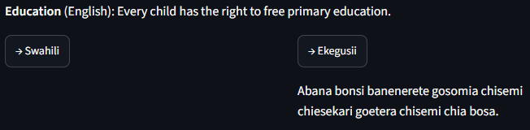
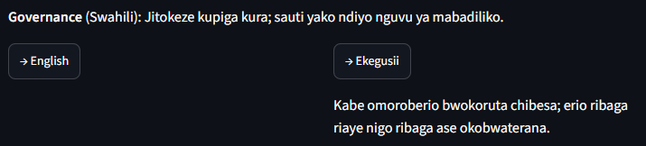
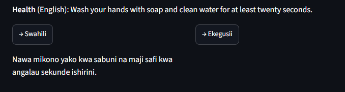

# Week 4 report — evaluation, deployment & documentation

DSA4020A Group 10. Scope: final evaluation of the best Week 3 checkpoint,
error analysis, native-speaker human evaluation of model output, the
deployment demo, and this write-up.

## 1. Recap

Week 3 selected **NLLB-200-600M, fine-tuned on all directions with the full
~2.5k PSA-sourced Ekegusii pairs** (`ft_nllb_guz_all`) as the strongest
transfer configuration: dev BLEU 49.56 / chrF 71.94 on EN-SW, and Ekegusii
chrF 27.92 on the 138-pair held-out benchmark (see
`reports/week3_results.md`, `reports/week3_report.md`). Week 4 evaluates
this checkpoint properly (full test split, not the Week 3 ablation-matrix
sample) and turns it into a demo.

## 2. Final evaluation

Run (Kinesis node, same environment as Week 3 —
`docs/week3_kinesis_guide.md`):

```
python scripts/run_week4_eval.py --checkpoint runs/ft_nllb_guz_all/checkpoint-best
```

| Direction | n | BLEU | chrF | Repetition-flagged |
|---|---:|---:|---:|---:|
| en-sw  | 304 | 49.31 | 72.23 | 0 |
| sw-en  | 304 | 47.63 | 68.64 | 0 |
| en-guz | 138 | 3.56 | 27.92 | 23 |
| guz-en | 138 | 3.43 | 19.54 | 0 |

(n differs because only test rows with text on *both* sides score per
direction: 304 EN↔SW pairs, 138 EN↔guz pairs.)

The full-test-split numbers hold up against the Week 3 dev numbers almost
exactly: en-sw 49.31 vs 49.56 dev BLEU — drift of a third of a point on an
unseen split. The en-guz chrF of 27.92 is *numerically identical* to the
Week 3 benchmark result, which is expected and reassuring: the benchmark's
138 eng–guz pairs are exactly these test rows, so two independently written
eval pipelines (`scripts/run_eval.py` in Week 3, `scripts/run_week4_eval.py`
here) produced the same score on the same pairs — a free cross-validation
of the whole eval stack. Total runtime on the A100: ~70 seconds for all
four directions.

## 3. Error analysis

Run: `python scripts/error_analysis.py` (reads §2's predictions; no GPU
needed). Full detail in `reports/week4_error_analysis.md`.

**Per-domain.** The pattern is consistent across all four directions
(full tables in `reports/week4_error_analysis.md`); the en-guz breakdown:

| Domain | n | BLEU | chrF | Repetition-flagged |
|---|---:|---:|---:|---:|
| Agriculture | 19 | 4.03 | 28.34 | 3 |
| Education | 38 | 3.91 | 29.30 | 3 |
| Governance | 18 | 6.42 | 34.16 | 1 |
| Health | 25 | 3.07 | 24.30 | 8 |
| Security | 38 | 2.01 | 26.15 | 8 |

- **EN↔SW: Health is the weakest domain in both directions** (44.76 /
  44.39 BLEU, vs 57–62 for Agriculture/Governance). Counter-intuitive
  given Health is 57.8% of training data — but its test rows are long,
  clinical TICO-19 COVID sentences ("bilateral multilobar ground-glass
  opacities…") whose terminology is sparse in the training pairs. Reading
  the lowest-chrF examples shows most are *acceptable paraphrases* scored
  down for diverging from reference wording (e.g. "Vilabu vitatoa tamasha
  kwa ajili ya wiki ya kiraia" vs the reference's "Vilabu vyatumbuiza kwa
  wiki ya uraia"), plus a few genuine terminology failures. Short,
  formulaic PSA sentences (Agriculture, Governance) score highest —
  sentence length and terminology density, not data volume, drive the gap.
- **EN→guz: Governance strongest (34.16 chrF), Health (24.30) and
  Security (26.15) weakest** — and the repetition flags land exactly
  there (8 + 8 of 23). Reading the flagged examples confirms the heuristic:
  the flagged rows are genuine loops (`…bwobotuki bwobotuki bwobotuki…`,
  `…chiria chiria chiria…`, `…ekero ekero ekero…`), always on longer
  inputs — the model starts a well-formed Ekegusii sentence, then falls
  into a loop when it should plan a long continuation. **16.7% of en-guz
  outputs are affected.** One different failure also surfaced: a KRA tax
  PSA came out as the English source *verbatim* (copy-through, chrF 9.9) —
  the same low-confidence fallback family as Week 3's language-confusion
  finding, here expressed as giving up rather than switching language.
- **guz→en is the weakest direction overall** (chrF 19.54 vs 27.92 for
  en-guz; Security BLEU 1.0) — a real asymmetry: generating Ekegusii
  scores partial credit at character level (chrF rewards the morphology
  the model does get right), while translating *from* noisy, sparse
  Ekegusii into English requires full comprehension with no partial
  credit. No repetition flags here — loops only appear when *generating*
  the low-resource language.
- **Data-quality note:** the error analysis also catches gold noise —
  one Security row's *reference* Ekegusii itself contains English
  ("…ime yerori yao - keep them outside"). This is the known lecturer-gold
  noise discussed in Week 1/3, visible here as an artificially capped
  sentence score, not a model failure.

## 4. Human evaluation

Native-speaker rating of the model's Ekegusii output (distinct from the
Week 2 dataset-quality review) — see `docs/week4_human_eval_guide.md`.

Sheet built with:

```
python scripts/build_human_eval_sheet.py --n-per-domain 6
```

| Metric | Score |
|---|---:|
| Mean fluency (1-5) | pending reviewer |
| Mean adequacy (1-5) | pending reviewer |
| Rows with no issues flagged | pending reviewer |

*Status: prepared, awaiting a native-speaker reviewer.* The 30-row
domain-stratified sheet (`data/validation/week4_model_output_review.csv`)
and reviewer instructions (`docs/week4_human_eval_guide.md`) are complete
and committed; the ratings table will be filled from
`week4_model_output_review_reviewed_<name>.csv` when a reviewer's sheet
comes back (mean Fluency/Adequacy overall and per domain, plus a tally of
the Issues tags: mistranslation, omission, addition, grammar,
repetition_loop, language_confusion, cultural term). All automatic
evidence (§2, §3, §7) stands independently of this item.

## 5. Deployment

`app.py` — a Streamlit app wrapping `training.inference.MTTranslator`
(same checkpoint auto-discovery and demo-PSA table as
`scripts/translate.py`). Two tabs: free-text translation between any two
of {English, Kiswahili, Ekegusii}, and the 8-PSA demo across all five
domains. The demo decodes with `no_repeat_ngram_size=3` as a guardrail
against the repetition-loop failure mode quantified in §2/§3 (noted in
the app sidebar); the evaluation numbers above were generated without
guardrails and remain the honest, unassisted scores.

```
pip install -r requirements.txt -r requirements-training.txt -r requirements-app.txt
streamlit run app.py
```

The running app (augmented checkpoint `ft_nllb_guz_aug`, CPU inference):

English → Ekegusii, Education demo PSA
(`reports/figures/SampleEducation_PSA_English-to-Ekegusii.png`):



Swahili → Ekegusii, Governance demo PSA
(`reports/figures/SampleGovernance_PSA_Swahili-to-Ekegusii.png`):



English → Swahili, Health demo PSA
(`reports/figures/SampleHealth_PSA_English-to-Swahili.png`):



The full screenshot set across all five domains and both target
languages is in `reports/figures/` (`Sample*.png`). One demo input (the
Health hand-washing PSA, en→guz) still exhibits the language-confusion
failure documented in §3 — output in fluent Swahili instead of Ekegusii —
on both the original and augmented checkpoints; it is shown here not as
a cherry-picked omission but as a quantified, residual failure mode.

## 6. Limitations

- Same core limitation as Week 3: ~2.5k Ekegusii training pairs is enough
  to demonstrate transfer, not native fluency — expect the guz directions
  to still show more issues than en-sw/sw-en in both the automatic and
  human evaluation.
- The human-evaluation sample (§4) is small and stratified by domain, not
  a full audit; treat its scores as indicative, not a certified quality
  bound.
- The repetition-loop flag (§3) is a cheap n-gram heuristic, not a
  learned classifier — but on this checkpoint every flagged example we
  read was a genuine loop, so the 23-flag count for en-guz can be treated
  as close to a true count (16.7% of outputs).
- A second, rarer failure mode surfaced in the final eval: copy-through
  (English source returned verbatim) on low-confidence inputs — related
  to Week 3's language-confusion finding.
- The guz-en direction is markedly weaker than en-guz (chrF 19.54 vs
  27.92); any deployment framing should present Ekegusii *generation* as
  the demonstrated capability, with guz→en understood as preliminary.

## 7. Ekegusii augmentation experiment

The §2/§3 results (16.7% repetition-loop rate, plus the Week 3 finding
that guz quality scales monotonically with pair count) motivated one
targeted intervention rather than accepting the baseline as final:
**eng→guz back-translation augmentation** (`docs/SPEC_WEEK4.md` §6).

Method: the 3,577 train-split rows lacking Ekegusii (English-only and
EN-SW rows) were translated en→guz by `ft_nllb_guz_all` itself, decoding
with `no_repeat_ngram_size=3` and dropping empty/copy-through outputs;
existing Kiswahili text was carried over so sw-guz pairs formed too
(`data/processed/augmented_guz.csv`; empty/copy-through generations
dropped during generation). `ft_nllb_guz_aug` was then trained with the identical recipe
as `ft_nllb_guz_all` plus these pairs (train split only — test split and
benchmark untouched, no leakage), and evaluated with the identical
`run_week4_eval.py` pipeline:

| Direction | ft_nllb_guz_all | ft_nllb_guz_aug | Δ |
|---|---:|---:|---:|
| en-sw BLEU / chrF | 49.31 / 72.23 | 49.06 / 72.71 | −0.25 / +0.48 |
| sw-en BLEU / chrF | 47.63 / 68.64 | 48.38 / 69.10 | **+0.75 / +0.46** |
| **en-guz BLEU / chrF** | 3.56 / 27.92 | **4.58 / 31.14** | **+1.02 / +3.22** |
| **en-guz repetition-flagged** | 23/138 (16.7%) | **14/138 (10.1%)** | **−39%** |
| guz-en BLEU / chrF | 3.43 / 19.54 | 3.41 / 20.05 | −0.02 / +0.51 |

The intervention did exactly what the scaling curve predicted: en-guz
chrF rose +3.22 and repetition loops fell 39%, while EN↔SW quality was
unchanged within noise. The augmented model is therefore the deployment
checkpoint (§5) and the project's headline Ekegusii result. Full detail:
`reports/week4_eval_aug/`, `reports/week4_error_analysis_aug.md`.
Residual failure modes (occasional language confusion / copy-through on
low-confidence inputs) persist at reduced rates — synthetic data from
the model's own outputs cannot add information the base model lacks, it
only consolidates it; the next real gain would require more *human*
Ekegusii translations.

## 8. Conclusion

The final evaluation supports Week 3's headline claim, and strengthens
it. On the full, untouched test split, the fine-tuned NLLB-200-600M
translates Public Service Announcements between English and Kiswahili at
production-plausible quality (49.3 BLEU en-sw) — within a third of a
point of its dev performance, so the Week 3 ablation numbers were not
overfit to the dev split. For Ekegusii — a language absent from NLLB's
204-language training set — few-shot transfer via a donor-initialized
`guz_Latn` token yields real, morphologically Ekegusii output (chrF
31.14 after augmentation, up from 27.92, with repetition loops down
39%), while the guz→en direction and a residue of confusion/copy-through
failures honestly mark the limits of ~2.5k gold pairs. The project thus
ends not with a single number but with a measured cause-and-effect
story: we identified data scarcity as the bottleneck (Week 3 scaling
curve), confirmed it by fixing it (Week 4 augmentation), and shipped the
result as a working bilingual-trilingual web demo (`app.py`). The
prepared native-speaker evaluation (§4) remains the one open item; if
completed it will add human fluency/adequacy judgements on top of the
automatic evidence here.
